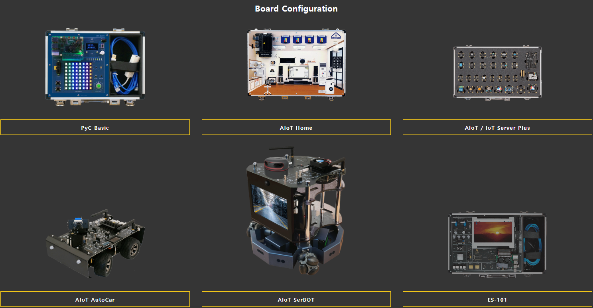
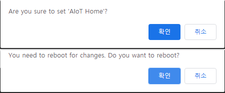

<h1> Board Configuration </h1>

<h2> Access the settings page </h2>
You can configure the board according to the edge device board you use.
 
At first, When the edge device is powered on and the edge device and host PC are connected to each other, you need to open a Chrome browser on the host PC and access <b>"192.168.101.101:7000"</b> 

<h2> Choose your target platform </h2>
Find the board you want to set up in the picture and product name and select the product 

<h2> Reboot your system </h2>
It needs to be rebooted to finish the configurations 
If you click "OK" in the warning window that appears in the Chrome browser, the system will reboot.
After reboot, libraries and system settings of Soda OS will be set to the target platform you choose 

