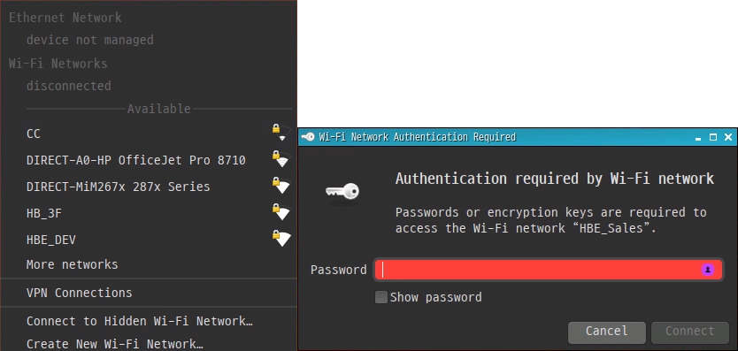
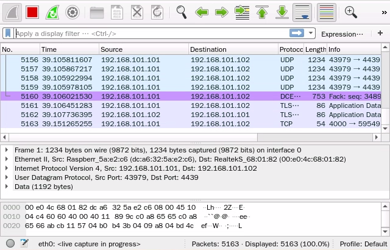

<h1> Connectivity </h1>

## <h2> Wi-Fi </h2>
For internet, you can connect Wi-Fi to a router connected to the internet  
When connecting an edge device to a specific router, 
- right click the network settings icon
- select the AP to connect to
- enter the password

## <h2> Bluetooth </h2>
Pairing proceeds in the form of transmitting information after one side detects it when one side exposes its information, and it is necessary to accept each other.  

There are procedures for Bluetooth communication with an edge device with Soda OS installed 
- Click the Bluetooth icon below then click "Make Discoverable" and it lasts 1 minute
- Find the name of the edge device on your smartphone and register it
- Select Confirm and Accept in the windows for pairing

## <h2> Network Analyzer </h2>
Wireshark is one of a nice open-source network analyzer. 
A tool that captures and analyzes packets on network interfaces in real time through kernel services.  

Capturing data across networks involves the following steps 

- Select the interface to capture.
- Enter keywords in the display filter
- Check the packet raw data after selecting the received packet

