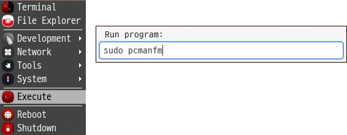

<h1> Desktop Environment </h1>
The Soda OS desktop environment of the edge device is a GUI environment that runs on the X Window System (Xorg) 
The Soda OS desktop environment is a collection of several programs running on the display server including

&emsp;<code class="code_accent">Window Manager</code> : Controls windows alignment and shapes 
&emsp;<code class="code_accent">Display Manager</code> : Manages login of the desktop environment 
&emsp;<code class="code_accent">Session Manager</code> : Save and restore desktop state 

## <h2> Desktop components </h2>
Soda OS desktops pursue simplicity, so it's consisted only of the desktop and panels  

The menu can be displayed by right-clicking.
When you run a program, the name is displayed on the program execution bar. Right-clicking the name will immediately close it 

## Safe Shutdown
It's recommended to select "Shutdown" from the Soda OS menu, wait for about 10 seconds, and then disconnect the power when it is completely turned off.  

## Program Execution
You can also run it by selecting "Run" from the Soda OS menu and entering the program name. This function is used when running a program not registered in the menu or running as a program with root privileges. 

## Audio Settings
In the case of the edge device has speakers or microphones, you can configure speakers or microphones in Soda OS. 

<h3>Volume</h3>
After placing the mouse cursor on the audio settings icon, you can adjust the volume gauge by moving the mouse wheel.  
To set the silence, click the audio setting icon. 

<h3>Device Settings</h3>
To select an audio device or manipulate additional settings, right-click on the audio settings icon and select "Preferences"