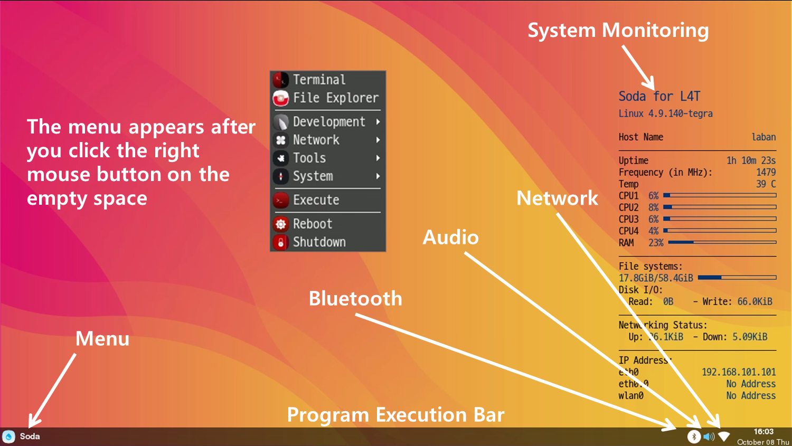

<h1> Desktop Environment </h1>
The Soda OS desktop environment of the edge device is a GUI environment that runs on the X Window System (Xorg) 
The Soda OS desktop environment is a collection of several programs running on the display server including

&emsp;<code class="code_accent">Window Manager</code> : Controls windows alignment and shapes 
&emsp;<code class="code_accent">Display Manager</code> : Manages login of the desktop environment 
&emsp;<code class="code_accent">Session Manager</code> : Save and restore desktop state 

<h2> Desktop components </h2>
Soda OS desktops pursue simplicity, so it's consisted only of the desktop and panels  
The desktop continuously displays the system monitoring, and a menu can also be displayed by right-clicking.
When you run a program through the menu, the name is displayed on the program execution bar. Right-clicking the name will immediately close it 

<h2> Audio Configuration </h2>

<h2> Connectivity </h2>

<h3> Wi-Fi </h3>
For internet use, you can connect Wi-Fi to a router connected to the internet. When connecting an edge device to a specific router, right-click the'System Tray> Network Settings Icon', select the AP to connect to, and enter the password. 

<h3> Bluetooth </h3>
There are two procedures for Bluetooth communication with an edge device with Soda OS installed 
&emsp;<code class="code_accent">Make Discoverable</code> : Click the Bluetooth icon below then click "Make Discoverable" and it lasts 1 minute 
&emsp;<code class="code_accent">Register the edge device</code> : Find the name of the edge device on your smartphone and register it 
&emsp;<code class="code_accent">Confirm and Accept</code> : select Confirm and Accept in the windows for pairing 