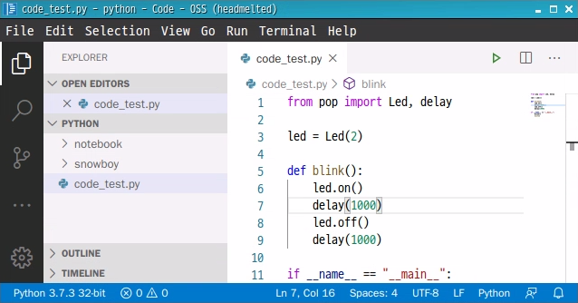
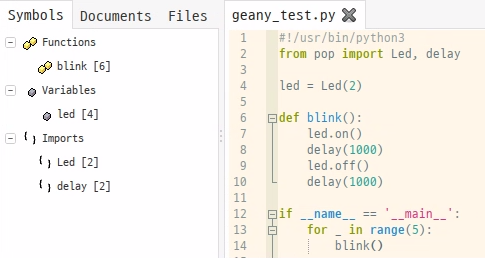
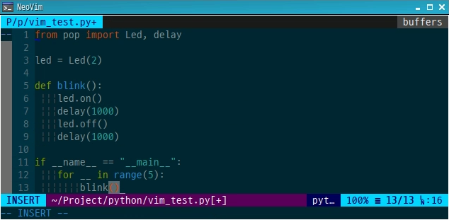
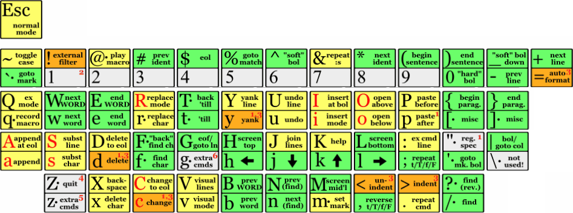

<h1> Development </h1>
There are three tools for software development 

&emsp;<code class="code_accent">VSCode</code> : Visual Studio Code 
&emsp;<code class="code_accent">Geany</code> : Light-weight and Fast IDE 
&emsp;<code class="code_accent">Neovim</code> : Vim based terminal code editor 
&emsp;<code class="code_accent">Jupyter Lab</code> : Development environment for editing Python code in a web browser 

## <h2>VSCode</h2>
The Visual Studio Code is an open-source IDE that supports Windows, Linux, Mac.  
Soda OS has Python related plugins applied, so you can start a Python project right away by running Visual Studio Code.

Special features 
&emsp;<code class="code_accent">Run and Debug</code> 
&emsp;<code class="code_accent">Auto completion</code> 
&emsp;<code class="code_accent">Extra plugins</code> 

## <h2>Geany</h2>
An open source IDE that is lighter than Visual Studio Code. Debugging is not supported for Python projects.

Special features 
&emsp;<code class="code_accent">Run</code> 

## <h2>Neovim</h2>
Vim is an extension of Vi, a traditional Unix editor, and Neobeam is a modern reimplementation of Vim to support an asynchronous execution environment.

Special features 
&emsp;<code class="code_accent">No GUI required</code> 
&emsp;<code class="code_accent">Plugins</code> 

Keyboard Shortcuts

## <h2>Jupyter Lab</h2>
An open source IDE that is lighter than Visual Studio Code. Debugging is not supported for Python projects.