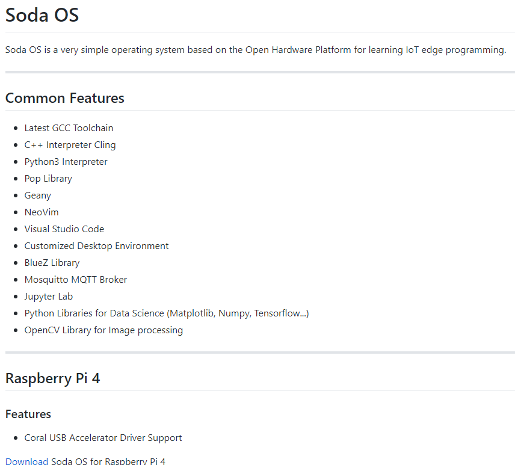
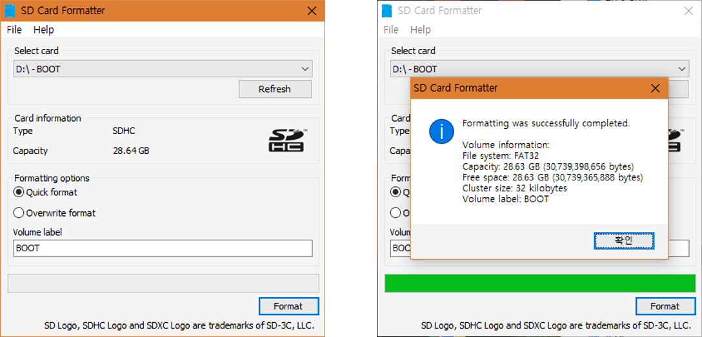
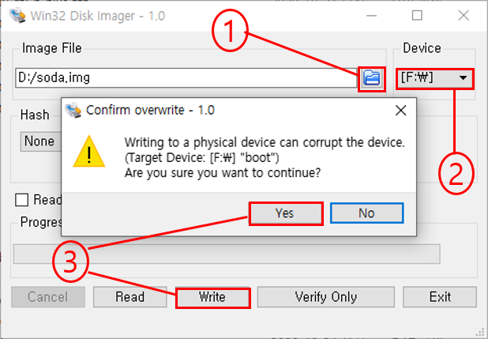

<h1> Soda OS Download and Installation </h1>

## <h2> Soda OS Donwload </h2>
To install and use Soda OS for the first time or to restore it to its initial state, you need to download the image.

The download path is as follows.

[Download Page](https://github.com/hanback-docs/Soda)

Here, programs such as compression programs and SD Formatter are bundled for user convenience and provided under the name of "host tools".

The list of programs included in "host tools" is as follows.

<h4> HostTools </h4>
&emsp;<code class="code_accent">Bonjour Browser</code> : Discover devices on the network 
&emsp;<code class="code_accent">D2CodingFonts</code> : Free coding-only fonts 
&emsp;<code class="code_accent">iPuTTY</code> : Virtual Terminal 
&emsp;<code class="code_accent">VcXsrv</code> : X Server for Windows 
&emsp;<code class="code_accent">NoMachine</code> : Remote Desktop 
&emsp;<code class="code_accent">Win32DiskImager</code> : Image Writer 
&emsp;<code class="code_accent">WinSCP</code> : Remote Explorer 

## <h2> SD Card Formatting </h2>

This is performed when Soda OS cannot be installed by Win32DiskImager due to a logical error in the SD memory. If there is no problem, this operation is skipped.

Users who need it download SDFormatter from the following path and install it.

[SDFormatter](https://www.sdcard.org/downloads/formatter/eula_windows/index.html)

Connect the prepared SD memory to an SD reader, plug it into a PC, and run SD Card Formatter to recognize the SD memory as a drive letter (eg D). Select this and press the Format button to format it again.

## <h2> Soda OS Installation </h2>
After inserting the SD memory into the PC using an SD reader, install the Soda OS image with Win32DiskImager.

<h4> Install Step </h4>
&emsp;<code class="code_accent">1. Select File</code> : Select the path where the Soda OS image file is located 
&emsp;<code class="code_accent">2. Select Target</code> : Select the SD Card Drive 
&emsp;<code class="code_accent">3. "Write" Click</code> : Select Yes when prompted 

## <h2> Soda OS Initialization </h2>
After writing to the SD memory, insert the SD memory into the edge device's SD memory slot and wait for the system to reboot after completing system setup in Soda OS 
