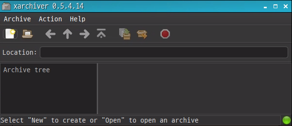
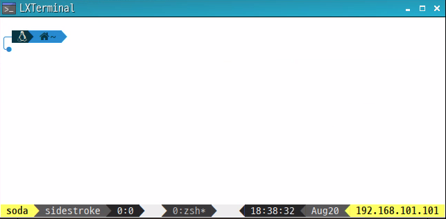
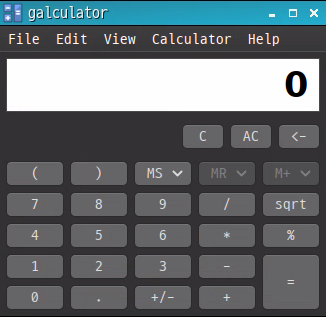
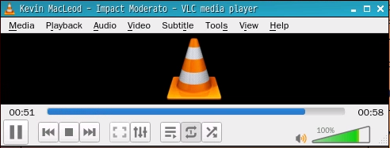
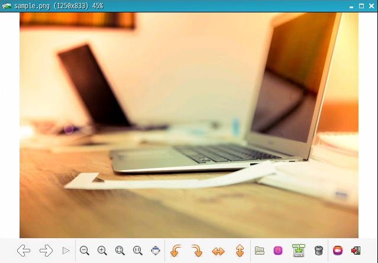
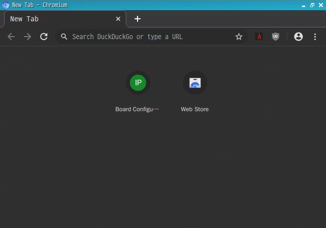
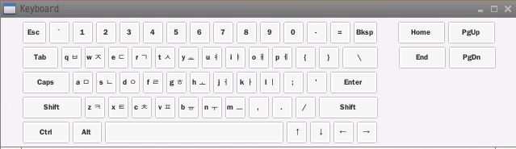
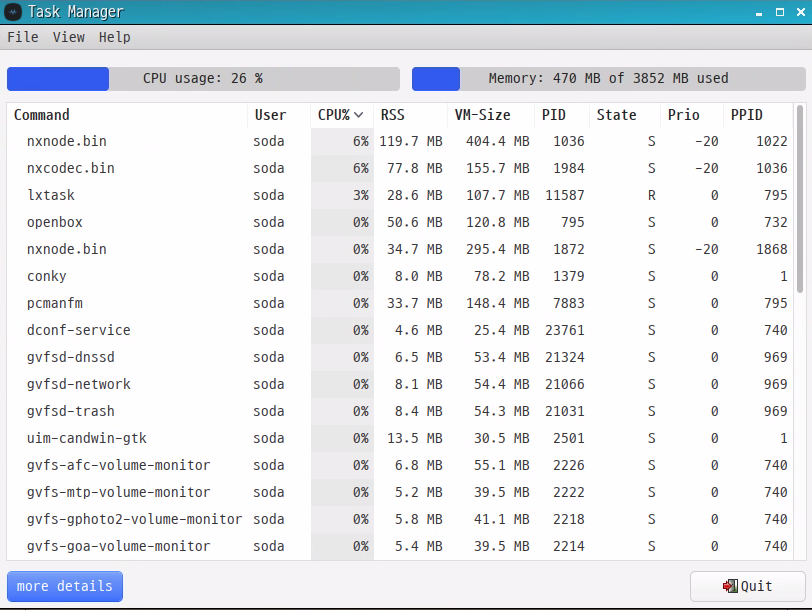
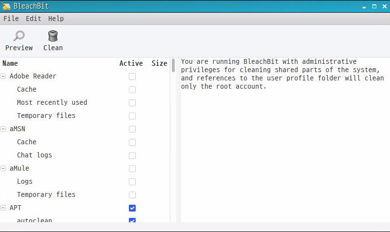

<h1> Utility </h1>
Soda OS provides several utility software for user convenience. They can be run from the command line or from a menu in the GUI. 

## Text Editor

## File Explorer

## Archive Manager

## Terminal

## Calculator

## Media Player

## Image Viewer

## Chromium Browser

## Virtual Keyboard

## Task Manager

## System Cleaner

