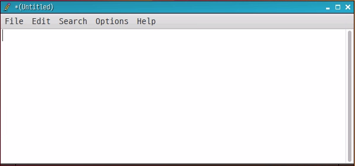

<h1> Utility </h1>
Soda OS provides several utility software for user convenience. They can be run from the command line or from a menu in the GUI.<br>

## Text Editor

The text editor is the most classic coding editor. Soda OS uses the open source leafpad, and its usage is the same as the notepad on a Windows host. Run it by clicking 'Tools> Text Editor' in the Soda OS menu, and the save format is UTF-8.



## File Explorer

Soda OS is a small and light PCManFM file manager similar to Windows Explorer, so even users who are not familiar with Linux can use it right away. However, since the Recycle Bin is set to not be used, files deleted with &lt;Del&gt; are deleted immediately.<br>
Click 'File Explorer' in the Soda OS menu to launch PCManFM.


## Archive Manager

Soda OS's archive manager is xarchiver, and double-clicking a compressed file like .zip in the file manager launches the archive manager. The usage is similar to Windows compression programs such as Bandizip.<br>
To run independently, click 'Tools > Archive Manager' in the Soda OS menu.


## Terminal

Soda OS uses a small and lightweight LXTerminal as a terminal. In Linux, a lot of work is done in a shell environment, so such a terminal is provided so that you can use the shell on the desktop as well.<br>
To run the terminal, click 'Terminal' in the Soda OS menu.


## Calculator

When writing a program, sometimes you need to convert numbers, trigonometric functions, exponential calculations, etc. You can use a calculator on a Windows host, but there is a calculator called Calculator in Soda OS, so use it.<br>
Click 'Tools > Calculator' in the Soda OS menu to run the calculator.


## Media Player

VLC Media Player, a media player provided by Soda OS, is a cross-platform open source media player developed by VideoLAN. VLC Media Player supports multiple audio and video codecs, and provides an easy-to-use and simple user interface.<br>
Click 'Tools > Calculator' in the Soda OS menu to run the calculator.


## Image Viewer

GPicView provided by Soda OS is a lightweight and fast open source image viewer with low memory usage. In addition, it does not require a specific desktop environment, so it can run without problems even if the desktop environment changes.<br>
Click 'Tools > Photo' in the Soda OS menu to run the calculator.


## Chromium Browser

The Chromium web browser is an open source web browser based on the Chromium project. You can use most of the features provided by Google's Chrome browser, such as installing and running extensions, viewing PDFs, and language translation.<br>
Click 'Network > Chrome Browser' in the Soda OS menu to run the calculator.


## Virtual Keyboard

If you have connected the optional touch screen to the edge device, you will need a virtual keyboard. Click 'System > Virtual Keyboard' on the panel to open the open source matchbox virtual keyboard.


## Task Manager

To check the currently running program information, click 'System > Task Manager' in the Soda OS menu. The compact and lightweight LXTask task manager shows the CPU and memory usage, status, PID (self ID), PPID (parent ID), etc. of currently running programs in an update cycle.


## System Cleaner

If you use an edge device for a long time, unnecessary files accumulate in the storage, resulting in insufficient space or performance degradation.If you click'System> System Cleaner' in the Soda OS menu and run BleachBit, a representative open source cleaner, this Can be organized.<br><br>
Soda OS uses zsh as its default shell, but zsh usage history is not organized by BleachBit. However, you can remove it by running the following command in the terminal.

```bash
$ echo "" > ~/.zsh_history & exec $SHELL –l
```

<br>

